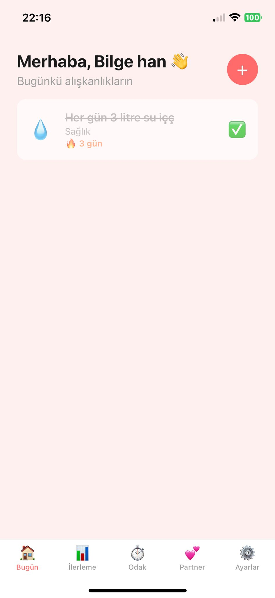
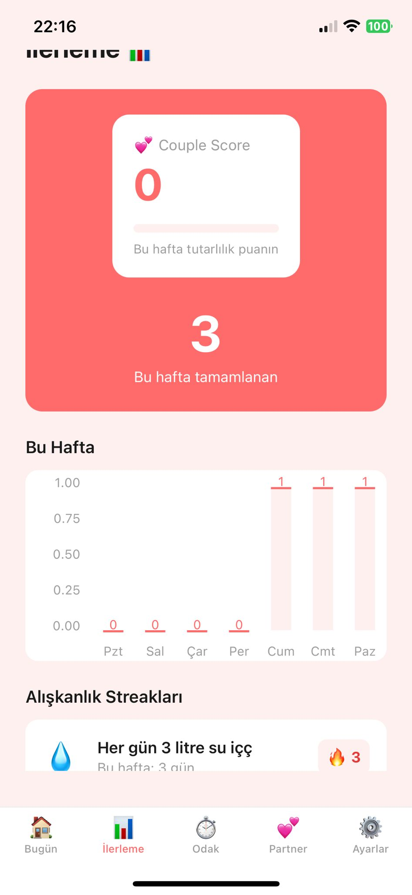
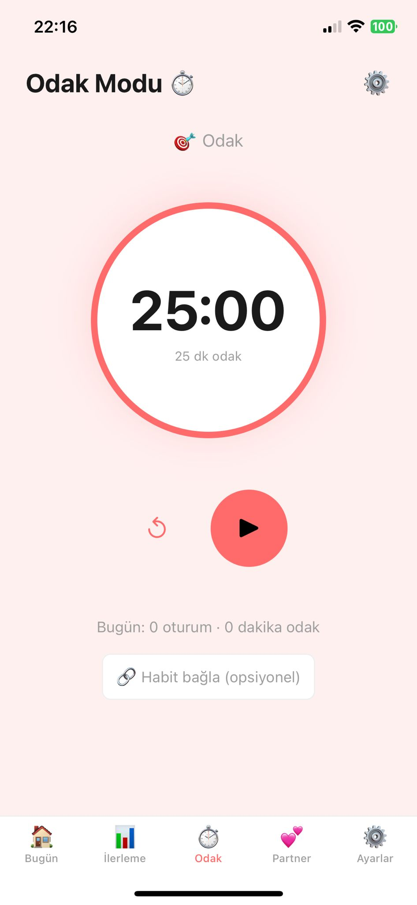
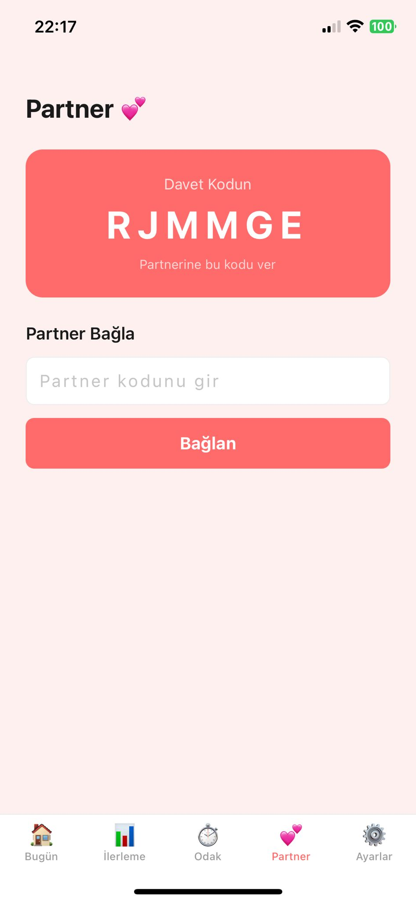
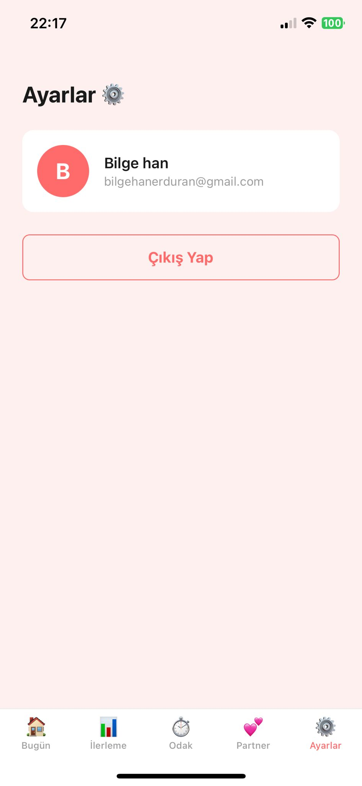

# HabiTogether 💕

> **The habit tracker that keeps you and your partner on track — together.**

A mobile habit tracking app built for couples. Link accounts with your partner, create shared habits, track streaks together, and keep each other accountable through real-time sync, nudges, and focus sessions.

---

## Screenshots

| Home | Progress | Focus | Partner | Settings |
|------|----------|-------|---------|----------|
|  |  |  |  |  |

---

## Features

### 🔐 Authentication & Partner Linking
- Email/password sign-up and login
- Generate a unique 6-character invite code
- Partner enters your code → accounts are instantly linked
- App works solo before linking (graceful degradation)

### ✅ Habit Management
- Create habits with name, emoji icon, category, and frequency (daily / weekly / custom days)
- Two habit types: **Solo** (only you track) and **Shared** (both partners must complete)
- Edit, archive, or delete habits
- Tap to mark complete with streak tracking
- Long press to view habit detail

### 🔥 Streaks & Progress
- Individual streak counter per habit
- **Shared habits**: streak only continues if BOTH partners complete it that day
- Streak milestones: 7, 30, 100 days — with celebration modal
- Streak-at-risk warning banner when you haven't completed a habit today
- Weekly bar chart showing daily completion counts
- **Couple Score**: weekly consistency percentage

### ⚡ Real-Time Sync
- When your partner completes a habit, your screen updates instantly
- Built with Supabase Realtime (PostgreSQL subscriptions)
- **Nudge button**: send a gentle poke notification to your partner

### ⏱️ Focus Sessions (Pomodoro)
- Built-in Pomodoro timer with configurable focus and break durations
- See your partner's focus status in real-time (focusing / idle)
- Link a focus session to a specific habit — auto-marks it complete
- Session history: track today's sessions and total focus minutes

---

## Tech Stack

| Layer | Technology |
|-------|-----------|
| Framework | React Native + Expo (Managed Workflow) |
| Language | TypeScript |
| Navigation | Expo Router (file-based) |
| Backend | Supabase (Auth + Database + Realtime) |
| Database | PostgreSQL |
| State | React Hooks (useState, useEffect) |
| Charts | react-native-chart-kit |

---

## Project Structure

```
app/
├── (auth)/
│   ├── _layout.tsx
│   ├── login.tsx
│   └── register.tsx
├── (tabs)/
│   ├── _layout.tsx
│   ├── index.tsx        # Home / Daily checklist
│   ├── progress.tsx     # Stats, charts, Couple Score
│   ├── focus.tsx        # Pomodoro timer
│   ├── partner.tsx      # Partner linking & nudge
│   └── settings.tsx     # Profile & logout
├── _layout.tsx          # Root layout + auth guard
├── index.tsx            # Session redirect
├── create-habit.tsx     # Create / Edit habit form
└── habit-detail.tsx     # Habit detail + calendar view

components/
└── ScreenWrapper.tsx    # Shared layout wrapper

constants/
└── colors.ts            # Design tokens

lib/
└── supabase.ts          # Supabase client
```

---

## Database Schema

```sql
profiles        -- id, display_name, partner_id, invite_code
habits          -- id, owner_id, name, icon, frequency, is_shared, category, is_archived
completions     -- id, habit_id, user_id, completed_date
focus_sessions  -- id, user_id, duration_min, linked_habit_id, status, started_at
nudges          -- id, from_user_id, to_user_id, created_at
```

---

## Getting Started

### Prerequisites
- Node.js 18+
- Expo Go app on your phone
- Supabase account

### Installation

```bash
git clone https://github.com/bherduran/HabiTogether.git
cd HabiTogether
npm install
```

### Environment Setup

Create a `.env` file in the root:

```env
EXPO_PUBLIC_SUPABASE_URL=your_supabase_url
EXPO_PUBLIC_SUPABASE_ANON_KEY=your_supabase_anon_key
```

### Run

```bash
npx expo start
```

Scan the QR code with Expo Go.

---

## What I Learned

- React Native + Expo end-to-end (navigation, state, native APIs)
- TypeScript in a mobile context
- Real-time data sync with Supabase Realtime (WebSocket subscriptions)
- Authentication and user relationship management
- Relational data modeling with PostgreSQL
- Cross-platform development (iOS + Android from one codebase)
- File-based routing with Expo Router

---

## Roadmap

- [ ] Push notifications (daily reminders, streak-at-risk alerts)
- [ ] Dark mode
- [ ] Language support (English / Turkish)
- [ ] Habit templates (starter packs for couples)
- [ ] Photo proof on habit completion
- [ ] Weekly summary notifications
- [ ] App Store / Google Play release


---


## Developer

**Bilge Han Erduran** — April 2026
